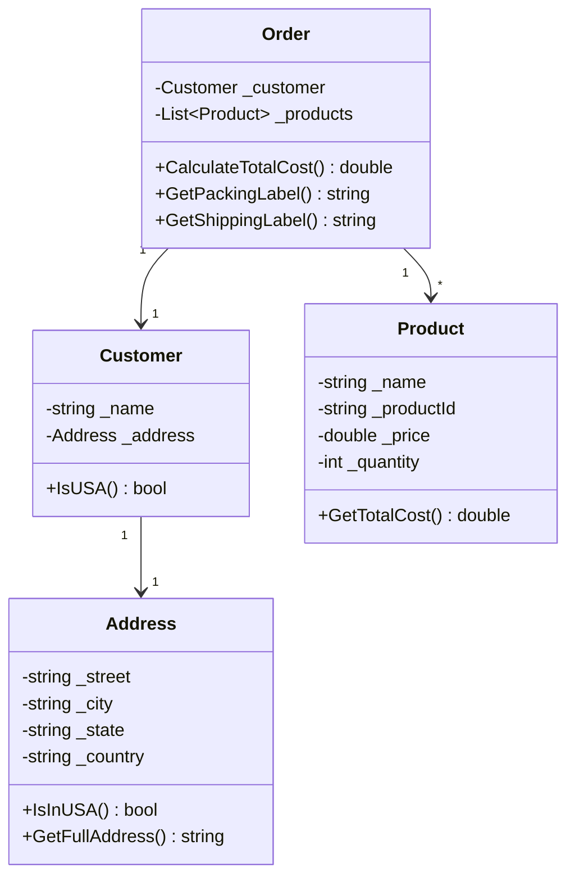

```mermaid
classDiagram
    class Order {
        -Customer _customer
        -List~Product~ _products
        +CalculateTotalCost() double
        +GetPackingLabel() string
        +GetShippingLabel() string
    }
    class Customer {
        -string _name
        -Address _address
        +IsUSA() bool
    }
    class Address {
        -string _street
        -string _city
        -string _state
        -string _country
        +IsInUSA() bool
        +GetFullAddress() string
    }
    class Product {
        -string _name
        -string _productId
        -double _price
        -int _quantity
        +GetTotalCost() double
    }
    Order "1" --> "1" Customer
    Order "1" --> "*" Product
    Customer "1" --> "1" Address
```