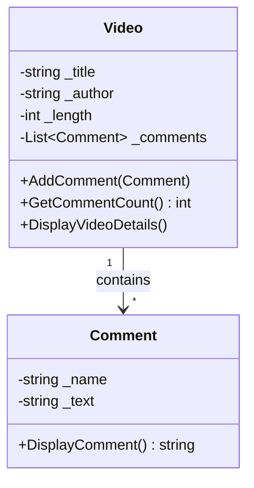

```mermaid
classDiagram
    class Video {
        -string _title
        -string _author
        -int _length
        -List~Comment~ _comments
        +AddComment(Comment)
        +GetCommentCount() int
        +DisplayVideoDetails()
    }
    class Comment {
        -string _name
        -string _text
        +DisplayComment() string
    }
    Video "1" --> "*" Comment : contains
```